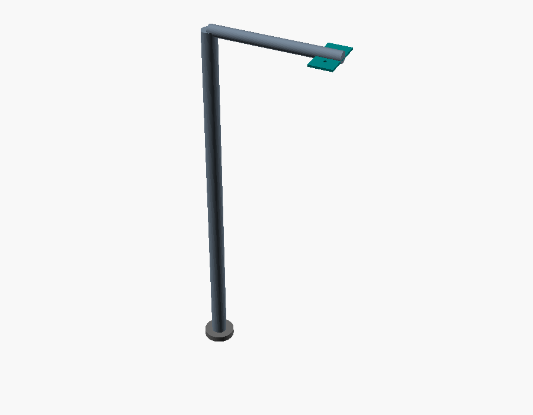

# Foldbot — sistema DIY de plegado automático de ropa

Prototipo casero y **modular** para doblar ropa de forma automática. En lugar de
un robot humanoide, se divide el problema en 4 bloques independientes que se
integran al final:

1. **Visión RGB-D** — cámara con profundidad (se compra en noviembre).
2. **Clasificación de prendas** — IA en PC / Raspberry Pi.
3. **Brazo pick-from-top** — DIY, 4–5 DOF + pinza suave.
4. **Máquina de plegado** — tablero con solapas actuadas (el brazo solo coloca,
   el tablero dobla).

> **Prioridad actual (Fase 0):** documentar y diseñar primero (3D, eléctricos,
> BOM). Fabricar después. Conectar visión/IA sólo cuando llegue la cámara.

> ⚠️ **Decisión de calidad (importante):** para agarrar ropa de forma fiable
> —sobre todo **toallas**— la opción recomendada **no** es el brazo articulado de
> servos, sino un **pórtico XYZ + cabezal de aguja retráctil**. El "agarre de
> tela" es el módulo más crítico del proyecto. Ver
> [`docs/07-viabilidad-y-riesgos.md`](docs/07-viabilidad-y-riesgos.md).

## Flujo del sistema


## Estructura del repositorio

```
foldbot/
├── README.md                  ← este archivo (roadmap y visión)
├── docs/
│   ├── 01-arquitectura.md     ← visión del sistema y flujo
│   ├── 02-mecanica-brazo.md   ← DOF, alcance, pinza, materiales
│   ├── 03-mecanica-plegado.md ← geometría de solapas, secuencia por prenda
│   ├── 04-electronica.md      ← alimentación, control, diagramas de corriente
│   ├── 05-presupuesto.md      ← BOM con costo estimado por módulo
│   ├── 06-cronograma.md       ← qué hacer antes / después de noviembre
│   └── 07-viabilidad-y-riesgos.md ← auditoría honesta + rediseño recomendado
├── cad/                       ← modelos OpenSCAD paramétricos (→ STL)
│   ├── params.scad            ← parámetros globales compartidos
│   ├── arm.scad               ← brazo 4 DOF + pinza
│   ├── folding_board.scad     ← tablero de plegado con solapas
│   ├── camera_mount.scad      ← soporte cenital de la cámara
│   ├── Makefile               ← render por lotes a STL
│   └── stl/                   ← salidas .stl (generadas)
├── diagrams/                  ← esquemas eléctricos y de secuencia
│   ├── power_single_line.mmd  ← diagrama unifilar de alimentación
│   ├── control_bus.mmd        ← bus de control Pi ↔ MCU ↔ servos
│   ├── fold_sequence_camiseta.mmd
│   ├── connections.csv        ← lista de conexiones señal por señal
│   ├── render.sh              ← render de .mmd → .svg
│   └── svg/                   ← salidas .svg (generadas)
└── software/                  ← scaffold mínimo (fase posterior)
    ├── foldbot_ai/            ← clasificador + API local
    ├── tests/                 ← pruebas del clasificador y la API
    ├── requirements.txt
    └── README.md
```

## Vistas de los modelos 3D (Fase 0)

Renders de referencia generados desde los modelos OpenSCAD (`cad/preview/`):

| Brazo 4 DOF + pinza | Tablero de plegado | Soporte de cámara |
| --- | --- | --- |
|  |  |  |

## Alcance del MVP (v1)

| Incluye | No incluye (v1) |
| --- | --- |
| 1 prenda a la vez | Montones enredados |
| Mesa limpia | Planchado |
| 4 clases: `camiseta`, `pantalon`, `boxer_ropa_interior`, `toalla` | Múltiples brazos |
| Brazo DIY + tablero de solapas | Precisión industrial |
| Docs 3D / eléctricos / presupuesto | Lavado |

## Roadmap por fases

- **Fase 0 — Ahora (diseño, sin cámara):** arquitectura, CAD de brazo y tablero,
  diagramas eléctricos, BOM/presupuesto, lista de compras priorizada.
- **Fase 1 — Fabricación mecánica/eléctrica:** imprimir/cortar piezas, montar
  electrónica, calibrar servos, probar secuencias de plegado a mano.
- **Fase 2 — Software de clasificación (en paralelo):** dataset + entrenamiento
  + evaluación de las 4 clases; CLI/app de prueba con fotos del celular.
- **Fase 3 — Llega la cámara (noviembre):** montaje, calibración cámara↔mesa,
  detección + punto de agarre con profundidad, integración.
- **Fase 4 — Integración y robustez:** reintentos de agarre, ajuste de
  secuencias por tipo, demo end-to-end con 1 prenda.

## Herramientas de diseño

- **CAD:** [OpenSCAD](https://openscad.org) (paramétrico y versionable en git).
  Ver [`cad/`](cad/).
- **Diagramas:** Mermaid (se renderiza en GitHub) + SVG exportado. Ver
  [`diagrams/`](diagrams/).
- **Software:** Python (scaffold de clasificación + API local). Ver
  [`software/`](software/).

Decisión: **no dependemos de software propietario** para el primer entregable.

## Cómo generar los artefactos

```bash
# STL desde los modelos OpenSCAD
cd foldbot/cad && make            # requiere: openscad

# SVG desde los diagramas Mermaid
cd foldbot/diagrams && ./render.sh   # requiere: @mermaid-js/mermaid-cli (mmdc)

# API de clasificación (MVP sin cámara)
cd foldbot/software && pip install -r requirements.txt
python -m foldbot_ai.api           # expone POST /classify en :8000
```
