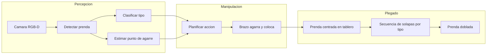
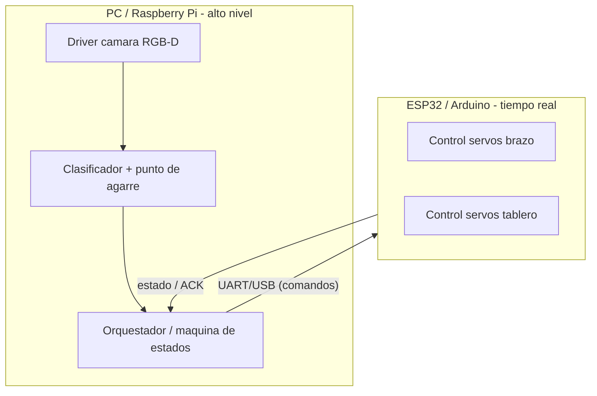
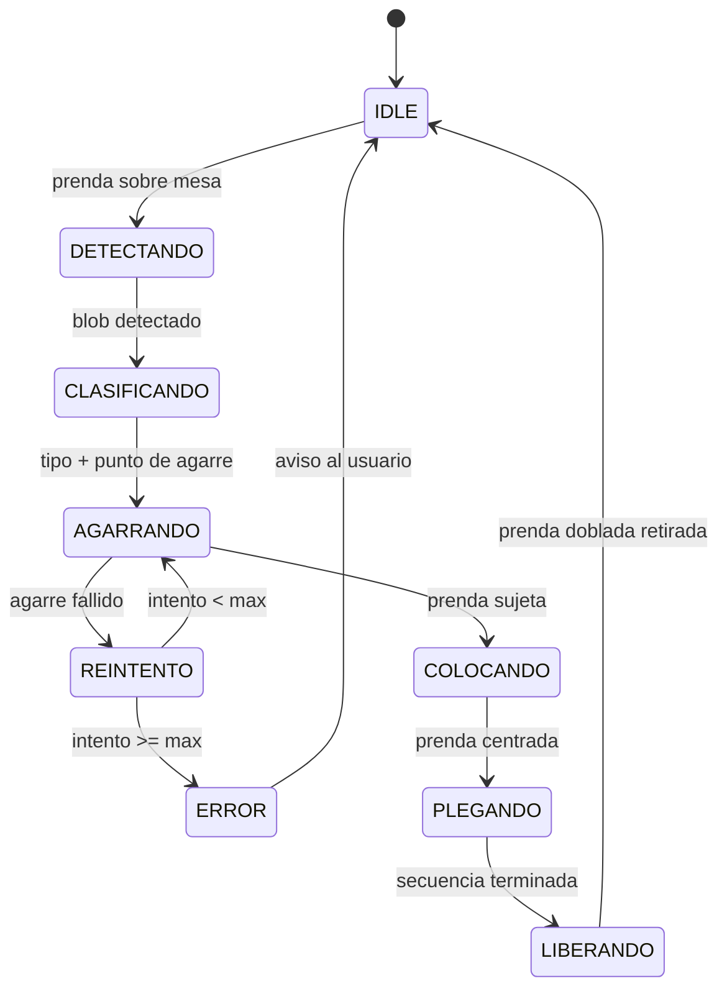

# 01 — Arquitectura del sistema

## Objetivo

Doblar **una prenda a la vez** sobre una mesa limpia, de forma automática,
usando componentes de hobby (impresión 3D, servos, un microcontrolador y una
cámara RGB-D). El diseño evita la complejidad de un robot humanoide repartiendo
el trabajo entre un **brazo simple** (que sólo agarra y coloca) y un **tablero
de plegado** (que hace los dobleces).

## Principio de diseño: "el tablero hace el trabajo pesado"

La ropa es un objeto **deformable**: agarrarla y manipularla con un brazo de
muchos grados de libertad es difícil y caro. La decisión clave de arquitectura
es **mover la dificultad del brazo al tablero**:

- El **brazo** sólo necesita: recoger la prenda desde arriba (pick-from-top),
  llevarla a una posición conocida y **soltarla centrada** en el tablero.
- El **tablero** (con solapas actuadas) ejecuta una **secuencia determinista**
  de dobleces según el tipo de prenda.

Esto reduce los requisitos del brazo a ~4 DOF y una pinza suave, y hace que el
plegado sea repetible y fácil de depurar.

## Bloques y responsabilidades

| Módulo | Responsabilidad | Hardware principal | Fase |
| --- | --- | --- | --- |
| A — Visión RGB-D | Imagen color + profundidad, punto de agarre | Intel RealSense D435 (o Orbbec) | 3 |
| B — Clasificación IA | Etiqueta de tipo de prenda (4 clases) | PC / Raspberry Pi | 2 |
| C — Brazo DIY | Pick-from-top y colocar centrado | 4 DOF + pinza suave, ESP32 | 1 |
| D — Tablero de plegado | Dobleces por secuencia | Solapas + servos | 1 |

## Arquitectura de cómputo

- **Alto nivel (PC/Pi):** visión, IA y el **orquestador** (máquina de estados).
  Trabaja en "tiempo humano" (cientos de ms).
- **Bajo nivel (MCU):** genera PWM para los servos y ejecuta trayectorias/pausas
  con temporización fiable. Recibe **comandos de alto nivel** por UART/USB
  (p. ej. `PICK x y z`, `PLACE`, `FOLD camiseta`) y responde con `ACK`/`DONE`.

Esta separación permite avanzar el software (Módulo B) **sin** el brazo, y
probar el brazo/tablero **sin** la cámara.

## Máquina de estados del orquestador (Fase 3–4)

## Interfaces entre módulos (contratos)

| De → A | Interfaz | Contenido |
| --- | --- | --- |
| Cámara → IA | frame RGB-D | imagen color (H×W×3) + profundidad (H×W, mm) |
| IA → Orquestador | JSON | `{ "tipo": "camiseta", "confianza": 0.93, "agarre": {x,y,z} }` |
| Orquestador → MCU | ASCII/serial | `PICK x y z` · `PLACE` · `FOLD <tipo>` · `HOME` |
| MCU → Orquestador | ASCII/serial | `ACK` · `DONE` · `ERR <codigo>` |

El **contrato IA→Orquestador** está implementado ya en el scaffold de software
(ver [`../software/`](../software/)) como una API local `POST /classify`, para
poder desarrollar y probar sin hardware.

## Suposiciones y límites (v1)

- Fondo de mesa **uniforme y contrastante** con la ropa (facilita segmentar).
- **Una** prenda por ciclo, extendida aproximadamente (no hecha bola).
- Iluminación estable (evitar sombras duras que confundan la profundidad).
- Prendas **secas** de 200–500 g. Nada de jeans pesados mojados en v1.

## Referencias cruzadas

- Mecánica del brazo → [`02-mecanica-brazo.md`](02-mecanica-brazo.md)
- Mecánica del tablero → [`03-mecanica-plegado.md`](03-mecanica-plegado.md)
- Electrónica y corrientes → [`04-electronica.md`](04-electronica.md)
- Presupuesto/BOM → [`05-presupuesto.md`](05-presupuesto.md)
- Cronograma → [`06-cronograma.md`](06-cronograma.md)
