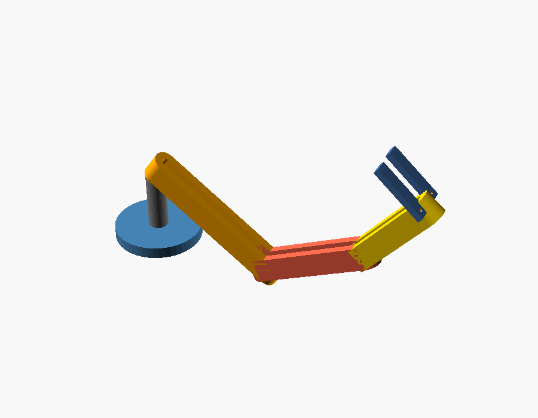
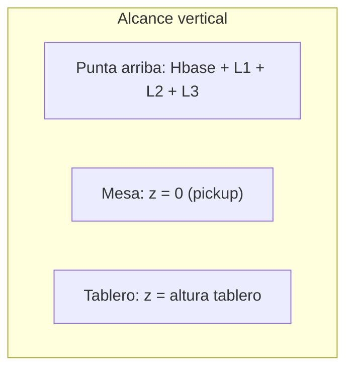

# 02 — Mecánica del brazo DIY

## Resumen

Brazo **pick-from-top** de **4 DOF + pinza** (gripper), pensado para ropa ligera.
Su única tarea es recoger una prenda desde arriba y **colocarla centrada** en el
tablero de plegado. No dobla nada por sí mismo.

- **DOF:** base (giro) · hombro · codo · muñeca (pitch) · **+ pinza**.
- **Alcance objetivo:** cubrir una mesa de ~50×50 cm (zona pickup → zona plegado).
- **Carga útil:** 200–500 g (camiseta / toalla seca).
- **Pinza:** suave (dedos con espuma/silicona). Las pinzas rígidas fallan con
  tela deformable.




*Render del ensamble de referencia (`cad/arm.scad`) en una pose de ejemplo.*

## Cinemática y dimensiones (paramétrico)

El brazo es un **manipulador planar de 3 eslabones** (hombro, codo, muñeca) sobre
una **base rotatoria** (convierte el plano en un volumen de trabajo cilíndrico).

| Símbolo | Descripción | Valor inicial | Parámetro OpenSCAD |
| --- | --- | --- | --- |
| `L1` | Eslabón hombro→codo | 150 mm | `arm_L1` |
| `L2` | Eslabón codo→muñeca | 120 mm | `arm_L2` |
| `L3` | Muñeca→punta de pinza | 90 mm | `arm_L3` |
| `Hbase` | Altura de la base al hombro | 70 mm | `arm_base_h` |
| `R` | Alcance horizontal máx. | ~360 mm | derivado |

> Alcance horizontal máximo ≈ `L1 + L2 + L3` = 150 + 120 + 90 = **360 mm** desde
> el eje de la base. Con la base en el borde de la mesa, cubre de sobra los
> 50 cm de lado a lado si se coloca en una esquina (diagonal ≈ 707 mm) o al
> centro de un borde (ver envelope abajo).

Todas las longitudes viven en [`../cad/params.scad`](../cad/params.scad) para
poder ajustar el diseño sin editar geometría.

### Envelope de trabajo (vista lateral)



El **CAD** genera dos proyecciones de referencia:

- **Vista lateral:** envelope de trabajo (arco de alcance del brazo).
- **Vista superior:** área de cobertura (círculo de radio `R` desde la base).

## Actuadores (servos)

| Junta | Par requerido (aprox.) | Servo sugerido | Notas |
| --- | --- | --- | --- |
| J0 Base | Bajo (sólo giro) | MG996R | Carga axial, poco par |
| J1 Hombro | **Alto** | DS3218 (20 kg·cm) | Soporta todo el brazo extendido |
| J2 Codo | Medio-alto | DS3218 / MG996R | |
| J3 Muñeca | Bajo-medio | MG996R | Orientación de la pinza |
| Pinza | Bajo | SG90 / MG90S | Apertura/cierre |

### Estimación de par en el hombro (peor caso)

Brazo totalmente extendido horizontal, con carga en la punta:

```
tau_hombro ≈ (m_carga · g · R) + (peso propio de eslabones · brazo de palanca)
```

Con `m_carga` = 0.5 kg, `g` = 9.81 m/s², `R` = 0.36 m:

```
tau_carga ≈ 0.5 · 9.81 · 0.36 ≈ 1.77 N·m ≈ 18 kg·cm  (sólo la carga)
```

Sumando el peso propio de los eslabones se supera fácilmente 18 kg·cm, por eso el
hombro usa un servo de **~20 kg·cm (DS3218)** y se recomienda **contrapeso** o un
**resorte/gomas** de asistencia en J1. Mantener `L1`,`L2`,`L3` cortos reduce este
par (por eso los valores iniciales son conservadores).

## Materiales y fabricación

| Pieza | Material sugerido | Proceso |
| --- | --- | --- |
| Eslabones | PLA/PETG (impresión 3D) o perfil de aluminio | FDM / corte |
| Soportes de servo | PLA/PETG | FDM |
| Base | PLA + placa de MDF/acrílico | FDM + corte |
| Dedos de pinza | TPU o PLA con almohadilla de silicona/espuma | FDM |

- **PETG** para piezas con carga (hombro/codo) por su tenacidad; **PLA** para el
  resto por facilidad de impresión.
- Usar **rodamientos** (608ZZ) en la base para descargar el servo J0 de cargas
  radiales.

## Pinza suave (soft gripper)

Objetivo: sujetar tela sin dañarla y tolerando forma irregular.

- **Opción A (simple):** dos dedos rígidos impresos con **almohadilla de espuma
  o silicona** y un servo de apertura. Barato y suficiente para el MVP.
- **Opción B (avanzada):** dedos flexibles de TPU tipo "fin-ray" que se adaptan
  al contorno de la prenda.

Recomendación v1: **Opción A** (menos incertidumbre). Migrar a fin-ray si el
agarre resbala.

## Estrategia de agarre (pick-from-top)

1. La visión entrega el **centroide del blob más alto** (punto más cercano a la
   cámara cenital) → ese es el punto de agarre `(x, y, z)`.
2. El brazo baja **vertical** sobre ese punto, cierra la pinza, sube unos cm.
3. Si un sensor de corriente/tacto indica que **no** sujetó (o la prenda vuelve a
   caer), pasa a `REINTENTO` (ver máquina de estados en
   [`01-arquitectura.md`](01-arquitectura.md)).

## Salidas CAD asociadas

Ver [`../cad/arm.scad`](../cad/arm.scad). Genera:

- `stl/arm_full.stl` — ensamble de referencia (para ver proporciones/alcance).
- `stl/arm_link_l1.stl`, `arm_link_l2.stl`, `arm_link_l3.stl` — eslabones.
- `stl/gripper_finger.stl` — dedo de pinza imprimible.

> El objetivo del CAD en Fase 0 es **validar proporciones, alcance y ubicación de
> servos**, no ser la pieza final de producción.
