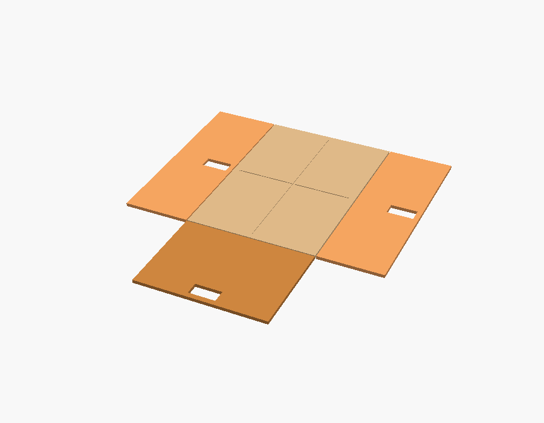
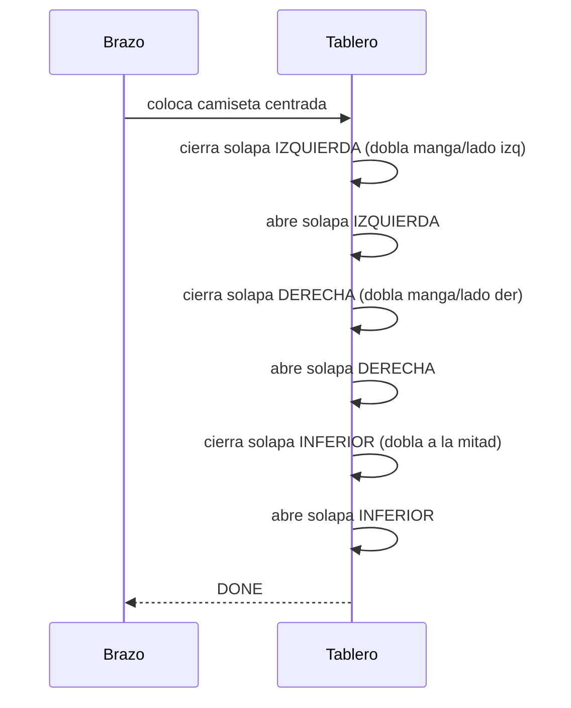

# 03 — Mecánica del tablero de plegado

## Concepto

Un **"folding board" actuado**: una base fija con **3 solapas abatibles**
(izquierda, derecha e inferior) accionadas por servos. El brazo coloca la prenda
centrada; el tablero ejecuta una **secuencia de dobleces** según el tipo.

```mermaid
flowchart TB
  subgraph Tablero (vista superior)
    L["Solapa IZQUIERDA"]
    C["Panel CENTRAL fijo"]
    R["Solapa DERECHA"]
    B["Solapa INFERIOR"]
    L --- C --- R
    C --- B
  end
```



*Render del tablero en posición "plano" (`cad/folding_board.scad`): panel central
con marcas de centrado, dos solapas laterales y una inferior, cada una con su
hueco de servo.*

## Dimensiones

| Símbolo | Descripción | Valor inicial | Parámetro OpenSCAD |
| --- | --- | --- | --- |
| `Wc` | Ancho del panel central | 200 mm | `board_center_w` |
| `Hc` | Alto del panel central | 300 mm | `board_center_h` |
| `Wl` | Ancho de cada solapa lateral | 100 mm | `board_side_w` |
| `Hb` | Alto de la solapa inferior | 150 mm | `board_bottom_h` |
| `t`  | Espesor de panel | 5 mm | `board_thickness` |

Tablero total ≈ **(Wc + 2·Wl) × (Hc + Hb)** = (200 + 200) × (300 + 150) =
**400 × 450 mm**. Suficiente para camiseta/toalla de tamaño medio.

## Actuación de las solapas

- **Bisagra** física (bisagra de piano o eje impreso) en el borde de cada solapa.
- **Servo por solapa** (3 en total) con **barra/brazo de empuje** (link) para
  convertir el giro del servo en el abatimiento de la solapa ~110–120°.
- Alternativa: **actuador lineal** para solapas grandes; para el MVP, servos de
  alto par (MG996R/DS3218) son suficientes.


Ángulo y tiempo por solapa se documentan como **tabla de secuencia** (abajo) y se
implementan en el firmware como pausas deterministas.

## Secuencias de plegado por tipo de prenda

La secuencia es **abrir → esperar posicionamiento → cerrar solapa → pausa**. El
brazo suelta la prenda con el tablero en posición "plano" (todas las solapas a 0°).

### Camiseta



| Paso | Solapa | Acción | Ángulo | Pausa |
| --- | --- | --- | --- | --- |
| 1 | Izquierda | cerrar | 110° | 800 ms |
| 2 | Izquierda | abrir | 0° | 400 ms |
| 3 | Derecha | cerrar | 110° | 800 ms |
| 4 | Derecha | abrir | 0° | 400 ms |
| 5 | Inferior | cerrar | 120° | 1000 ms |
| 6 | Inferior | abrir | 0° | 400 ms |

### Pantalón

1. Alinear piernas (colocación del brazo, piernas juntas).
2. Un pliegue **longitudinal** (una solapa lateral) para juntar ambas piernas.
3. Un pliegue **transversal** (solapa inferior) a la mitad/tercios.

| Paso | Solapa | Acción | Ángulo | Pausa |
| --- | --- | --- | --- | --- |
| 1 | Derecha | cerrar | 110° | 900 ms |
| 2 | Derecha | abrir | 0° | 400 ms |
| 3 | Inferior | cerrar | 120° | 1000 ms |
| 4 | Inferior | abrir | 0° | 400 ms |

### Boxer / ropa interior

Pliegues simples (prenda pequeña): 1–2 dobleces.

| Paso | Solapa | Acción | Ángulo | Pausa |
| --- | --- | --- | --- | --- |
| 1 | Inferior | cerrar | 120° | 700 ms |
| 2 | Inferior | abrir | 0° | 400 ms |

### Toalla

Dos o tres pliegues según tamaño (mismo patrón que camiseta pero con más pausa
por el grosor).

| Paso | Solapa | Acción | Ángulo | Pausa |
| --- | --- | --- | --- | --- |
| 1 | Izquierda | cerrar | 110° | 1000 ms |
| 2 | Izquierda | abrir | 0° | 500 ms |
| 3 | Derecha | cerrar | 110° | 1000 ms |
| 4 | Derecha | abrir | 0° | 500 ms |
| 5 | Inferior | cerrar | 120° | 1200 ms |
| 6 | Inferior | abrir | 0° | 500 ms |

> Estas tablas son el **contrato** entre diseño mecánico y firmware. Los tiempos
> se calibran en Fase 1 colocando la prenda a mano (sin visión).

## Materiales

| Pieza | Material | Notas |
| --- | --- | --- |
| Paneles | MDF 5 mm, acrílico o cartón pluma | Ligero y plano |
| Bisagras | Bisagra de piano o eje impreso (PLA) + varilla | Bajo rozamiento |
| Soportes de servo | PLA/PETG impreso | Atornillados al panel |
| Barras de empuje | Varilla de acero 2–3 mm + rótulas | Ajuste de longitud |

## Salidas CAD asociadas

Ver [`../cad/folding_board.scad`](../cad/folding_board.scad). Genera:

- `stl/folding_board.stl` — tablero con panel central y las 3 solapas en posición
  "plano" (para verificar dimensiones y huecos de bisagra/servo).

## Por qué este enfoque

- **Determinista y barato:** el plegado no depende de visión fina ni de un brazo
  complejo.
- **Depurable:** cada solapa es un servo y una pausa; fácil de calibrar por
  separado.
- **Escalable:** añadir una 4.ª solapa (superior) o cambiar ángulos es trivial
  (parámetros + tablas).
