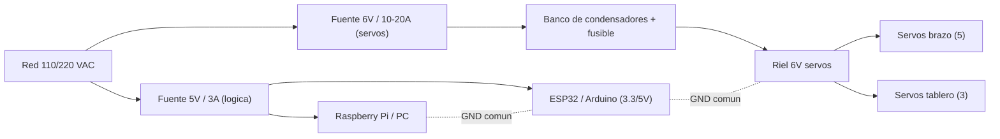
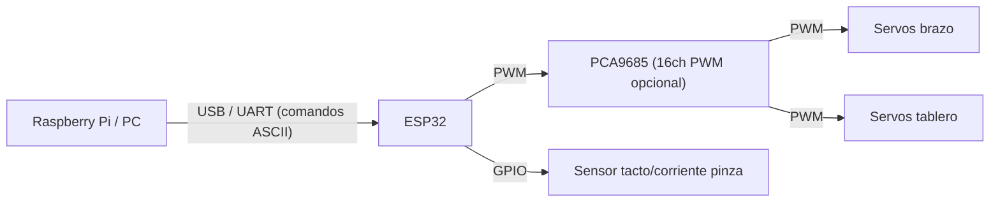

# 04 — Electrónica, alimentación y diagramas de corriente

## Principios

1. **Alimentación de servos separada de la lógica.** Los servos generan picos y
   ruido que pueden reiniciar el MCU si comparten riel.
2. **GND común** entre la fuente de servos, el MCU y la Pi/PC (referencia común
   de señal PWM).
3. **Dimensionar por corriente de bloqueo (stall)**, no por corriente nominal.
4. **Desacoplo** (condensadores) cerca de los servos y **fusible** en el riel de
   potencia.

## Arquitectura de alimentación (unifilar)



> El diagrama unifilar renderizable está en
> [`../diagrams/power_single_line.mmd`](../diagrams/power_single_line.mmd).

## Presupuesto de corriente (servos)

Regla práctica de dimensionado de la fuente de potencia:

```
I_fuente = N_servos_moviendose_a_la_vez × I_stall × margen
```

Corrientes de bloqueo típicas (a 6 V):

| Servo | I_stall (aprox.) | Uso |
| --- | --- | --- |
| SG90 / MG90S | ~0.7 A | pinza |
| MG996R | ~2.5 A | base, codo, muñeca, solapas |
| DS3218 | ~3.0 A | hombro, solapas grandes |

### Peor caso realista

En este diseño **no** se mueven todos los servos a la vez:

- Durante **pick/place**: se mueven ~2–3 servos del brazo simultáneamente.
- Durante **plegado**: se mueve **1 solapa a la vez** (secuencia).

Peor caso de brazo (3 servos grandes moviéndose + pinza):

```
I ≈ (2 × 3.0 A [DS3218/MG996R]) + (1 × 2.5 A) + (1 × 0.7 A) ≈ 9.2 A
```

Con margen ×1.5 → **≈ 14 A**. Por eso la fuente de servos se especifica en
**6 V / 15–20 A** (o dos fuentes de 10 A). Si se limita el número de servos en
movimiento simultáneo por firmware, se puede bajar a **6 V / 10 A**.

> **Importante:** en régimen normal (movimiento suave, sin bloqueo) el consumo es
> muy inferior; el dimensionado por stall es para **no reiniciar** el sistema
> ante un atasco momentáneo.

## Bus de control



- **PCA9685** (driver PWM I²C de 16 canales) recomendado: descarga al ESP32 de
  generar 8 PWM y da resolución estable de 12 bits.
- **Comunicación Pi ↔ MCU:** UART/USB con protocolo ASCII de línea:
  `PICK x y z\n`, `PLACE\n`, `FOLD camiseta\n`, `HOME\n` → respuestas
  `ACK\n` / `DONE\n` / `ERR <cod>\n`.

## Protecciones y buenas prácticas

| Elemento | Valor / tipo | Función |
| --- | --- | --- |
| Fusible en riel 6V | 15–20 A (según fuente) | Cortocircuito |
| Condensador bulk | 2200–4700 µF electrolítico | Absorbe picos de arranque |
| Condensador cerámico | 100 nF por servo | Ruido de alta frecuencia |
| Diodo TVS / flyback | opcional | Transitorios inductivos |
| GND común | estrella (single point) | Evita bucles de masa |
| Cableado potencia | AWG 16–18 en riel de servos | Baja caída de tensión |

## Lista de conexiones (extracto)

La lista completa señal por señal está en
[`../diagrams/connections.csv`](../diagrams/connections.csv). Ejemplo:

| Origen | Pin origen | Destino | Pin destino | Señal |
| --- | --- | --- | --- | --- |
| ESP32 | GPIO21 (SDA) | PCA9685 | SDA | I²C datos |
| ESP32 | GPIO22 (SCL) | PCA9685 | SCL | I²C reloj |
| PCA9685 | CH0 | Servo J0 base | señal | PWM |
| PCA9685 | CH1 | Servo J1 hombro | señal | PWM |
| Fuente 6V | V+ | Riel 6V | V+ | Potencia |
| Fuente 6V | GND | GND común | GND | Referencia |

## Verificación en Fase 1

1. Medir corriente real por junta con pinza amperimétrica al mover cada servo.
2. Confirmar que la tensión del riel de servos **no cae** por debajo de ~5.5 V en
   picos (si cae, añadir condensador bulk o subir sección de cable).
3. Confirmar que el MCU **no se reinicia** al mover servos (indicador de riel
   compartido o GND deficiente).
