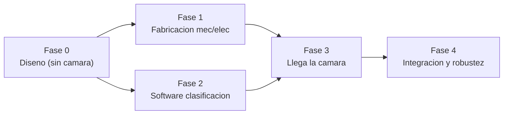
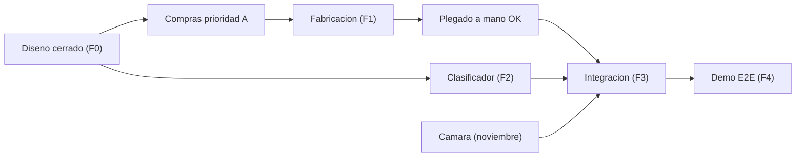

# 06 — Cronograma (la cámara llega en noviembre)

El cronograma está organizado por **fases con dependencias**, no por fechas
rígidas. La restricción externa clave: **la cámara RGB-D llega en noviembre**, así
que todo lo que **no** depende de la cámara se hace antes.

## Fase 0 — Ahora (diseño, sin cámara)

**Objetivo:** cerrar el diseño en papel/CAD antes de gastar en piezas.

- [x] Arquitectura y requisitos ([`01-arquitectura.md`](01-arquitectura.md))
- [x] CAD del brazo + tablero (proyecciones y STL) ([`../cad/`](../cad/))
- [x] Diagramas eléctricos y de secuencia ([`../diagrams/`](../diagrams/))
- [x] BOM / presupuesto ([`05-presupuesto.md`](05-presupuesto.md))
- [x] Scaffold de software de clasificación ([`../software/`](../software/))
- [ ] Lista de compras ordenada por prioridad (derivada del BOM)

**Entregable:** este repositorio `foldbot/` (documentación cerrada).

## Fase 1 — Fabricación mecánica/eléctrica

**Depende de:** Fase 0. **No depende de:** cámara.

- [ ] Imprimir/cortar piezas del brazo (eslabones, soportes, dedos de pinza).
- [ ] Imprimir/cortar tablero y solapas; montar bisagras.
- [ ] Montar electrónica (ESP32 + PCA9685 + fuentes) según
      [`04-electronica.md`](04-electronica.md).
- [ ] Calibrar servos (rango, home, límites).
- [ ] Probar **secuencias de plegado a mano** (colocar la prenda manualmente y
      validar las tablas de [`03-mecanica-plegado.md`](03-mecanica-plegado.md)).

**Criterio de éxito:** el tablero dobla correctamente una camiseta colocada a
mano, repetidamente.

## Fase 2 — Software de clasificación (en paralelo a Fase 1)

**Depende de:** Fase 0. **No depende de:** cámara ni brazo.

- [ ] Dataset: fotos propias + datasets públicos (DeepFashion / Clothes)
      reetiquetados a las 4 clases.
- [ ] Modelo inicial: transfer learning (MobileNetV2 / EfficientNet-lite).
- [ ] Evaluación (matriz de confusión de las 4 clases).
- [ ] CLI/app de prueba con fotos del celular (ya hay scaffold: `POST /classify`).

**Criterio de éxito:** clasificador ≥ ~90% en un set de validación propio.

## Fase 3 — Llega la cámara (noviembre)

**Depende de:** Fases 1 y 2.

- [ ] Montaje de la cámara (cenital, ~60–80 cm sobre la mesa).
- [ ] Calibración extrínseca cámara ↔ mesa (homografía / plano de trabajo).
- [ ] Detección de prenda + **punto de agarre** usando profundidad (centroide del
      blob más alto).
- [ ] Integrar: `clasificar → pick → place en tablero → secuencia de plegado`.

**Criterio de éxito:** ciclo automático completo con 1 prenda "fácil" (toalla).

## Fase 4 — Integración y robustez

- [ ] Reintentos si falla el agarre (ver máquina de estados).
- [ ] Ajuste de secuencias por tipo de prenda.
- [ ] Demo **end-to-end** con 1 prenda a la vez (4 clases).

**Criterio de éxito:** demo estable con las 4 clases, tasa de éxito aceptable.

## Ruta crítica

La **cámara no está en la ruta crítica hasta Fase 3**, por eso conviene tener
Fases 1 y 2 lo más avanzadas posible antes de noviembre.
